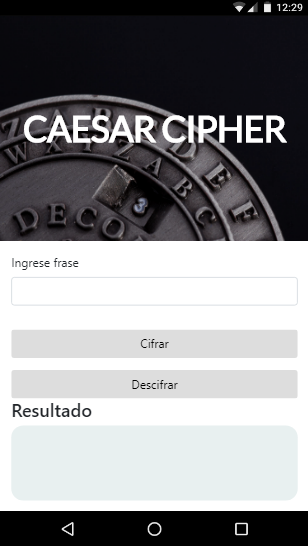

# Funciones **Cipher** y **Decipher** con ECMAScript 6  

## Función Cipher

Esta función consiste en el ingreso de un texto por el usuario, el texto será sustituido por otro según el cifrado César. 

## Función Decipher  

El usuario podrá descifrar el texto cifrado.  

## Herramientas  

* Bootstrap 4.  
* Jquery.

## Vista Desktop

## Vista Mobile

